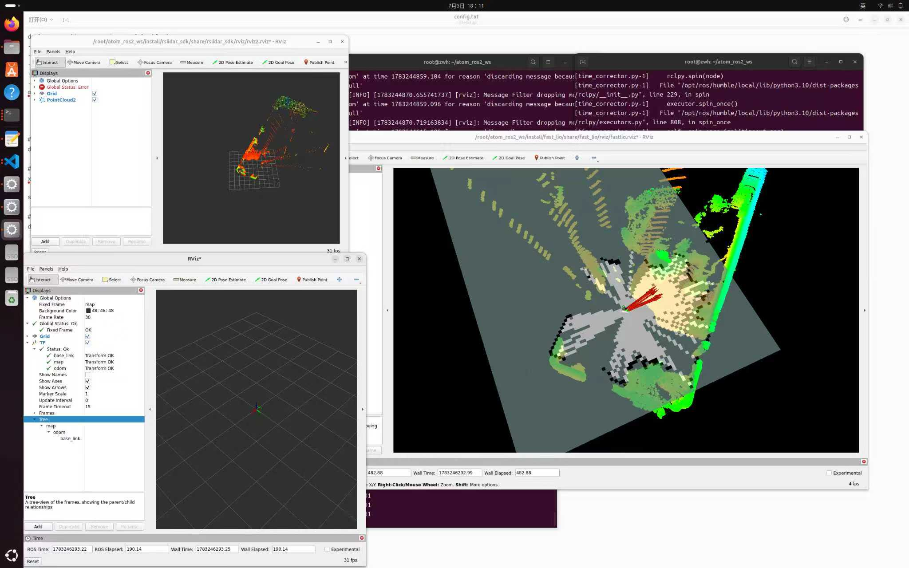

# SLAM-Nav

[中文文档](README_zh.md)

SLAM-Nav is a ROS 2 autonomous navigation project for real mobile robot platforms. It integrates LiDAR drivers, point-cloud adaptation, LiDAR-inertial mapping and localization, Nav2 planning, map conversion, and a control bridge for the Dobot Atom robot.

Rather than providing a single algorithm, the repository connects the complete data path from sensor acquisition to motion execution. Its goal is to support mapping, localization, obstacle avoidance, path planning, and velocity control on real hardware while leaving room for upper-body control and task-level coordination.

## Project Scope

SLAM-Nav is intended for systems that need to:

- Build a mobile robot navigation stack on ROS 2 Humble.
- Use a RoboSense or Livox LiDAR as the primary perception sensor.
- Run FAST-LIO for LiDAR-IMU odometry and 3D mapping.
- Use Nav2 for global planning, local avoidance, path tracking, and navigation behaviors.
- Forward Nav2 `/cmd_vel` output to a Dobot Atom robot.
- Convert a 3D PCD map into a 2D PGM/YAML occupancy map for `nav2_map_server`.

The project is integration-oriented. Upstream frameworks and vendor SDKs remain relatively independent, while project-owned launch files, bridge nodes, and topic conventions connect them into one system.

## System Architecture

The repository should be placed under the `src/` directory of a ROS 2 workspace. Its packages can be viewed as five layers:

```text
Sensor and driver layer
  RoboSense: rslidar_sdk + rslidar_msg
  Livox:     Livox-SDK2 + livox_ros_driver2

Point-cloud adaptation layer
  rs_to_velodyne_ros2

Mapping and localization layer
  FAST_LIO
  pcd2pgm

Navigation layer
  robot_navigation_bringup
  navigation2

Robot execution layer
  dobot_atom
  dobot_atom_bridge
```

A typical runtime data flow is:

```text
LiDAR / IMU
   |
   v
LiDAR driver publishes a point cloud
   |
   v
Point-cloud conversion and timestamp correction
   |
   v
FAST-LIO publishes odometry, TF, and a registered cloud
   |
   +--> pointcloud_to_laserscan generates /scan
   |
   v
Nav2 consumes the map, TF, /scan, and a goal to produce /cmd_vel
   |
   v
dobot_atom_bridge converts /cmd_vel into Dobot Atom control calls
```

`robot_navigation_bringup` is the system orchestration package. It does not implement the underlying SLAM or planning algorithms; it starts and connects the LiDAR driver, cloud converter, FAST-LIO, LaserScan conversion, Nav2, and the Dobot bridge.

## Recommended Workspace Layout

```text
SLAM-Nav_ws/
├── src/                                # This Git repository
│   ├── .git/
│   ├── dobot_atom/                     # Dobot Atom ROS 2 interfaces
│   ├── dobot_atom_bridge/              # ROS 2 to Dobot control bridge
│   ├── dobot_atom_sdk/                 # Official SDK Git submodule
│   ├── FAST_LIO/                       # LiDAR-inertial odometry and mapping
│   ├── ground_reset/                   # Ground calibration utilities
│   ├── Livox-SDK2/                     # Official Livox SDK
│   ├── livox_ros_driver2/              # Livox ROS 2 driver
│   ├── navigation2/                    # Nav2 source tree
│   ├── pcd2pgm/                        # PCD to PGM/YAML conversion
│   ├── robot_navigation_bringup/       # Project launch and Nav2 configuration
│   ├── rs_to_velodyne_ros2/            # RoboSense point-cloud adapter
│   ├── rslidar_msg/                    # RoboSense message definitions
│   └── rslidar_sdk/                    # RoboSense LiDAR driver
├── build/                              # Generated by colcon
├── install/                            # Generated by colcon
└── log/                                # Generated by colcon
```

The `build/`, `install/`, and `log/` directories are generated at the workspace root and should not be committed.

## Main Components

### `robot_navigation_bringup`

This is the main integration package for SLAM-Nav.

It contains:

- `launch/system.launch.py`: the system-level launch entry point.
- `launch/rslidar_scan.launch.py`: converts the registered FAST-LIO cloud into `/scan`.
- `config/nav2_params.yaml`: Nav2 controller, costmap, planner, and behavior-tree parameters.
- `config/amcl_params.yaml`: AMCL localization parameters.

Start here when changing topic names, map paths, velocity limits, costmap dimensions, obstacle parameters, or controller behavior.

### `FAST_LIO`

FAST-LIO fuses LiDAR and IMU data and publishes odometry, pose estimates, TF, and registered point clouds.

It serves two roles:

- Mapping: accumulating environmental point clouds into a 3D map.
- Localization: providing the robot pose and coordinate transforms required by navigation.

Its registered cloud is also converted to a 2D LaserScan for the Nav2 local costmap.

Sensor-specific configurations are under `FAST_LIO/config/`, including `mid360.yaml`, `rslidar.yaml`, and `velodyne.yaml`. A YAML filename does not by itself restrict the sensor model. Actual behavior is controlled by parameters such as the point type, topic names, scan lines, timestamp unit, filtering, and extrinsics.

### `navigation2`

`navigation2` contains the Nav2 source tree, including global planners, local controllers, behavior trees, costmaps, map services, lifecycle management, and RViz plugins.

SLAM-Nav uses Nav2 to:

- Receive navigation goals.
- Generate global paths.
- Avoid local obstacles.
- Track planned paths.
- Run navigation and recovery behaviors.
- Publish `/cmd_vel` to the robot bridge.

Because the full Nav2 source tree is included, the repository and build are considerably larger than a project that relies only on binary ROS packages.

### RoboSense packages

`rslidar_sdk` communicates with a RoboSense LiDAR and publishes point clouds. `rslidar_msg` provides its message definitions.

`rs_to_velodyne_ros2` converts RoboSense clouds into commonly supported `XYZI`, `XYZIR`, or `XYZIRT` layouts:

```text
/rslidar_points  -->  rs_to_velodyne_ros2  -->  /velodyne_points
```

This adapter allows algorithms designed around Velodyne-style fields to consume RoboSense data.

### Livox packages

`Livox-SDK2` and `livox_ros_driver2` provide an alternative sensor path for Livox devices.

When using a Livox LiDAR, verify:

- Device and host IP settings.
- Device configuration under `livox_ros_driver2/config/`.
- The matching FAST-LIO sensor parameters.
- Point-cloud topics, timestamp units, and frame IDs.

### `pcd2pgm`

`pcd2pgm` converts a 3D PCD map into a 2D occupancy map:

```text
map.pcd  -->  map.pgm + map.yaml
```

It is an offline map-production tool. A common workflow is to create a 3D map with FAST-LIO, extract the useful ground and obstacle region, and generate a PGM/YAML map for `nav2_map_server`.

### Dobot Atom integration

`dobot_atom` defines the ROS 2 interfaces used by the platform. `dobot_atom_bridge` connects ROS 2 topics to the robot RPC/DDS APIs. `dobot_atom_sdk` is the official SDK and is managed as a Git submodule.

The main control path is:

```text
Nav2 /cmd_vel  -->  dobot_atom_bridge  -->  Dobot Atom RPC/DDS
```

The bridge also exposes connection, FSM, and upper-body control interfaces. Because it depends on the adjacent SDK directory, the submodule must be initialized before building.

## Important Topics and Frames

| Type | Topic | Purpose |
|---|---|---|
| Raw point cloud | `/rslidar_points` | RoboSense driver output |
| Adapted point cloud | `/velodyne_points` | Velodyne-style point cloud |
| Registered point cloud | `/cloud_registered` | FAST-LIO output used to generate `/scan` |
| Laser scan | `/scan` | Nav2 local costmap input |
| Velocity command | `/cmd_vel` | Nav2 output consumed by the bridge |
| Connection state | `/connection_state` | Dobot bridge connection feedback |
| FSM state | `/fsm_state` | Dobot Atom state feedback |

Common frames include:

- `map`: global map frame.
- `Odometry`: odometry frame used by parts of the current configuration.
- `base_link`: robot base frame.
- `rslidar`: RoboSense LiDAR frame.

For real-robot debugging, TF continuity is often more important than whether each individual node starts. If Nav2 does not move, a costmap is empty, or RViz data is misaligned, inspect the complete `map -> Odometry -> base_link -> lidar` chain first.

## Requirements

Recommended environment:

- Ubuntu 22.04
- ROS 2 Humble Hawksbill
- `colcon` and `rosdep`
- PCL and Eigen3
- Nav2
- slam_toolbox
- pointcloud_to_laserscan
- Correct vendor SDK and network configuration for the selected LiDAR
- Network access to the Dobot Atom robot

Common binary dependencies can be installed with:

```bash
sudo apt update
sudo apt install \
  ros-humble-navigation2 \
  ros-humble-nav2-bringup \
  ros-humble-slam-toolbox \
  ros-humble-pointcloud-to-laserscan \
  libpcl-dev \
  libeigen3-dev
```

Additional dependencies may be required for a specific sensor or robot deployment.

## Clone and Initialize

Create a ROS 2 workspace and clone this repository directly as its `src/` directory:

```bash
mkdir -p ~/SLAM-Nav_ws
cd ~/SLAM-Nav_ws
git clone --recurse-submodules \
  git@github.com:valuless/SLAM-Nav.git src
```

If the repository was cloned without submodules:

```bash
cd ~/SLAM-Nav_ws/src
git submodule update --init --recursive
cd ~/SLAM-Nav_ws
```

Install dependencies from the workspace root:

```bash
rosdep install --from-paths src --ignore-src -r -y
```

## Build

Run the build from the workspace root, not from inside the repository:

```bash
cd ~/SLAM-Nav_ws
colcon build --symlink-install
source install/setup.bash
```

## Run

Start the integrated system:

```bash
ros2 launch robot_navigation_bringup system.launch.py
```

Start only the Dobot Atom bridge:

```bash
ros2 launch dobot_atom_bridge atom_bridge.launch.py
```

Override the robot RPC endpoint:

```bash
ros2 launch dobot_atom_bridge atom_bridge.launch.py \
  rpc_ip:=192.168.8.234 rpc_port:=51234
```

Start the RoboSense point-cloud converter:

```bash
ros2 launch rs_to_velodyne_ros2 convert.launch.py
```

Convert a PCD map to a 2D map:

```bash
ros2 launch pcd2pgm pcd2pgm.launch.py
```

These commands are entry points. Successful operation on a real robot still depends on correct LiDAR networking, IMU data, TF, map paths, Nav2 parameters, and robot control connectivity.

## Suggested Reading Order

For a first pass through the project:

1. Read `robot_navigation_bringup/launch/system.launch.py` to see which modules are started.
2. Read `robot_navigation_bringup/launch/rslidar_scan.launch.py` to understand how `/scan` is generated.
3. Inspect `robot_navigation_bringup/config/nav2_params.yaml` for Nav2 controller and costmap settings.
4. Inspect `dobot_atom_bridge/launch/atom_bridge.launch.py` to follow `/cmd_vel` into the robot.
5. Check either `rslidar_sdk` or `livox_ros_driver2` for the selected sensor.
6. Select and validate the matching configuration under `FAST_LIO/config/`.
7. Read `pcd2pgm/config/config_pcd2pgm.yaml` when producing a 2D map.

The project-specific engineering is primarily in how these modules are connected, so this order is usually clearer than starting from the internals of Nav2 or FAST-LIO.

## Troubleshooting

### No LiDAR data

Confirm the raw and converted topics before debugging downstream nodes:

```bash
ros2 topic list
ros2 topic hz /rslidar_points
ros2 topic hz /velodyne_points
```

Without a valid point cloud, FAST-LIO, LaserScan conversion, and Nav2 cannot operate correctly.

### Broken or discontinuous TF

Verify the complete frame chain:

```text
map
└── Odometry
    └── base_link
        └── lidar frame
```

If timestamps do not align, verify that the FAST-LIO point cloud, odometry, and `odom -> base_link` transform use the same LiDAR measurement timestamp.

### Invalid or empty `/scan`

Check:

- Whether `/cloud_registered` is being published.
- Whether `/scan` has a stable publication rate.
- Whether `min_height` and `max_height` select the correct vertical region.
- Whether `target_frame` can be transformed to `base_link`.
- Whether timestamps and TF buffers overlap.

### Nav2 cannot plan

Inspect:

- The map and YAML paths.
- Global and local costmaps.
- The initial pose.
- The navigation goal.
- The lifecycle state of Nav2 nodes.
- Planner, controller, and behavior-tree logs.

Some launch defaults are deployment-specific and may need to be overridden after moving the workspace to another machine.

### The robot does not move

Nav2 only publishes a velocity command. Physical motion also requires a healthy bridge and a reachable robot controller.

```bash
ros2 topic hz /cmd_vel
ros2 topic echo /connection_state
ros2 topic echo /fsm_state
```

Verify the RPC address, FSM state, command remapping, velocity limits, and emergency-stop state before testing motion.

## Configuration Guide

| Requirement | Primary location |
|---|---|
| Change system startup order | `robot_navigation_bringup/launch/system.launch.py` |
| Tune point-cloud to LaserScan conversion | `robot_navigation_bringup/launch/rslidar_scan.launch.py` |
| Tune Nav2 controllers and limits | `robot_navigation_bringup/config/nav2_params.yaml` |
| Tune AMCL | `robot_navigation_bringup/config/amcl_params.yaml` |
| Change Dobot Atom IP and port | `dobot_atom_bridge/launch/atom_bridge.launch.py` |
| Change RoboSense point layout | `rs_to_velodyne_ros2/launch/convert.launch.py` |
| Select or tune FAST-LIO sensor settings | `FAST_LIO/config/` |
| Generate a 2D occupancy map | `pcd2pgm/config/config_pcd2pgm.yaml` |

## Development Notes

- Keep point-cloud topic names, message fields, timestamp units, and frame IDs consistent when changing the sensor path.
- Nav2 is sensitive to TF, timestamps, and frame IDs; review all three after modifying odometry or point-cloud processing.
- The default Dobot Atom RPC address is `192.168.8.234`. Confirm that the host and robot are on reachable networks.
- `dobot_atom_sdk` is a Git submodule. Initialize it with `git submodule update --init --recursive` after a normal clone.
- Keep project-specific integration changes in `robot_navigation_bringup` and `dobot_atom_bridge` where practical.
- Do not commit workspace-generated `build/`, `install/`, or `log/` directories.
- Preserve the licenses and notices of included upstream projects.

## Known Considerations

- The repository is large because it includes upstream source trees, maps, documentation media, and test assets.
- A first clone and build can take significant time.
- The current target is Ubuntu 22.04 with ROS 2 Humble; other distributions require separate compatibility testing.
- Validate emergency stop, speed limits, network connectivity, and frame directions before operating on real hardware.

## License

This repository includes multiple upstream projects and vendor SDKs. Each component remains subject to the license and notices in its own `LICENSE`, `README`, or upstream repository. Project-owned integration code follows the license declared by its ROS package.


