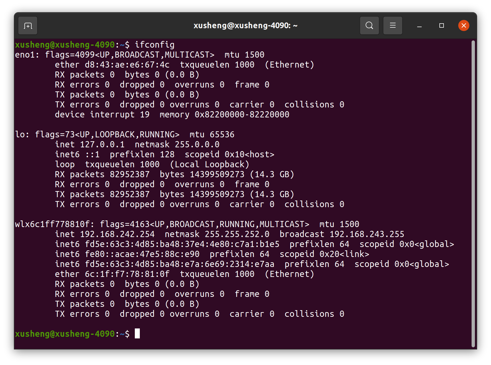

# README

## 📋 Content

- [Dobot Atom SDK User Manual](#dobot-atom-sdk-user-manual)
  - [📦 Compilation](#-compilation)
  - [🔎 Package Structure Analysis](#-package-structure-analysis)
  - [🔧 Configuration](#-configuration)
    - [1. Network Connection](#1-network-connection)
    - [2. DDS Configuration](#2-dds-configuration)
  - [🎮 Sample Program Execution](#-sample-program-execution)
    - [1. Run the High-Level RPC Sample](#1-run-the-high-level-rpc-sample)
    - [2. Run the Low-Level DDS Sample](#2-run-the-low-level-dds-sample)
    - [3. Run the Joint Recording Sample](#3-run-the-joint-recording-sample)

# Dobot Atom SDK User Manual

This manual provides a comprehensive guide for the Dobot Atom Robot SDK, covering **compilation, package structure analysis, configuration, and sample program execution**.

## 📦 Compilation

It is assumed that the working directory is `/home/atom/workspace`, and users can modify this path according to their actual situation.

```bash
cd /home/atom/workspace/dobot_atom_sdk
mkdir build
cd build
cmake ..
make
```

**Successful Compilation:** 
Executable files such as `rpc_test` (high-level RPC sample), `bridge_test` (low-level DDS sample), and `record_joint` (joint recording sample) will be generated in the `build` directory.

## 🔎 Package Structure Analysis

| **Directory Path**               | **Core Content & Function**                                                                                                                                                                                                 |
|----------------------------|---------------------------------------------------------------------------------------------------------------------------------------------------------------------------------------------------------------------|
| `dobot_atom_sdk/common`    | Common header files: Support the basic functions of all sample programs.                                                                                                                                                                                |
| `dobot_atom_sdk/config`    | Configuration file directory: <br>- `cyclonedds.xml`: DDS communication configuration; <br>- `controlParams.json`: Joint PID control parameters; <br>- `joint_angles.txt`: Joint trajectory file (for low-level DDS samples).                                                      |
| `dobot_atom_sdk/example`   | Sample code directory: <br>- `rpc_test.cpp`: High-level RPC control (FSM switching, speed control); <br>- `bridge_test.cpp`: Low-level DDS control (joint trajectory tracking); <br>- `record_joint.cpp`: Joint angle recording (generates joint trajectory files).                           |
| `dobot_atom_sdk/idl`       | DDS Interface Definition Files (IDL): e.g., `bms_cmd.idl` (Battery Management System commands), `main_nodes_state.idl` (robot node status). CycloneDDS generates C-language data types based on these files (stored in `build/generated_dds`).                           |
| `dobot_atom_sdk/rpc`       | RPC client interface directory: <br>- `base_rpc_client.h`: Basic RPC communication logic; <br>- `algs_rpc_client.h`: Motion control RPC interface; <br>- `gcontrol_rpc_client.h`: Voice/device control RPC interface;                                                 |
| `dobot_atom_sdk/build`     | Compilation output directory: Stores executable files, intermediate files, etc., generated during compilation.                                                                                                                                                                |                                                                                                                                                               |

## 🔧 Configuration

### 1. Network Connection

Connect one end of an Ethernet cable to the robot and the other end to your computer. Open the terminal and execute the ping command:

```bash
ping 192.168.8.234
```

If the following information appears, the connection is successful:

```bash
64 bytes from 192.168.8.234: icmp_seq=1 ttl=64 time=0.567 ms
64 bytes from 192.168.8.234: icmp_seq=2 ttl=64 time=0.612 ms
```

### 2. DDS Configuration

Enter `ifconfig` in the terminal to query the network card name. As shown in the figure below, the network card name is wlx6c1ff778810f.



Open the `dobot_atom_sdk/config/cyclonedds.xml` file and replace `eth0` with the queried network card name.

## 🎮 Sample Program Execution

In the `dobot_atom_sdk/build` folder, `rpc_test` is the high-level RPC sample, and `bridge_test` is the low-level DDS sample. For detailed introductions to the samples, please refer to the *Software Service Interface* document.

> ⚠️ Warning: The robot will move when running the following samples. Ensure the environment is safe before execution.
> 

### 1. Run the High-Level RPC Sample

**Function**: 
Control robot FSM state switching (e.g., Standby → Walking) and speed control (moving forward, backward, left, right) through command-line interaction.

```bash
cd build
./rpc_test
```

**Interactive Operations**:
Enter 1 → Enter FSM state control: First displays the current FSM ID, then enter the target ID;
Enter 2 → Enter speed control: You must first switch to an FSM state that supports speed control (e.g., 301 or 302), otherwise it will prompt “SetVel failed. Please enter fsm 301 or 302.”

> ⚠️ Warning: Ensure the robot has been switched to debug mode before running the following sample.
> 

### 2. Run the Low-Level DDS Sample

**Function**: Read the preset trajectory `config/joint_angles.txt` and control the robot joints to track the preset trajectory via DDS communication.

```bash
cd build
./bridge_test
```

### 3. Run the Joint Recording Sample

**Function**: Collect robot joint angles, save them to `joint_angles.txt`, and automatically append a “reverse trajectory” (to restore joints to the initial position). The generated file can be used by `bridge_test`.

```bash
cd build
./record_joint
```

**Recording Process**:
No trajectory will be recorded within 5 seconds after the program starts; you can manually adjust the robot joints to the initial position;
Recording starts after 5 seconds, and the terminal will display the current recording time;
After recording is completed, `joint_angles.txt` will be generated in the `build` directory. You can copy it to the `config` directory to replace the original file for use by `bridge_test`.

