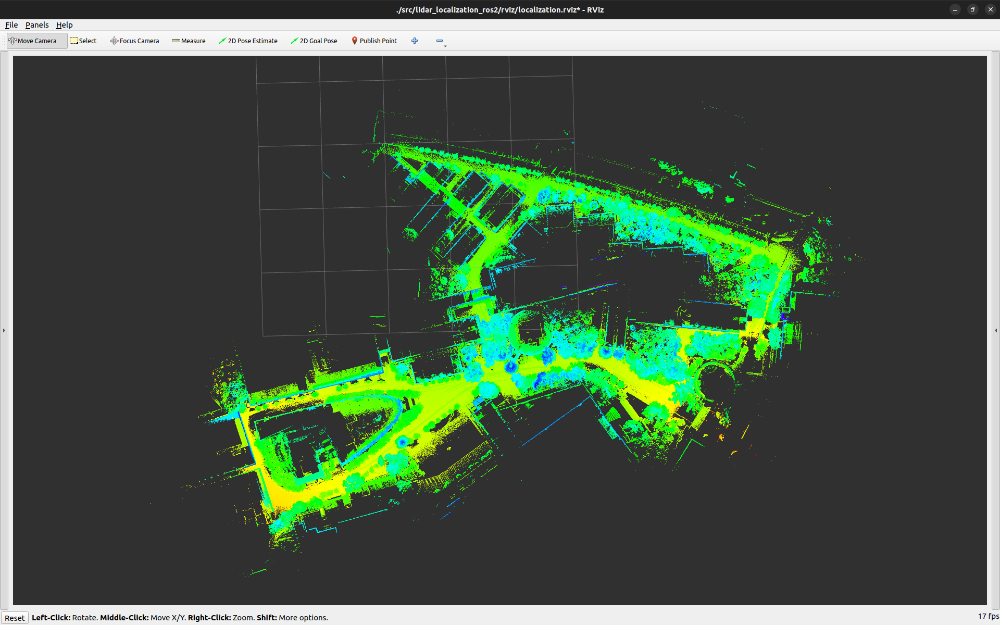
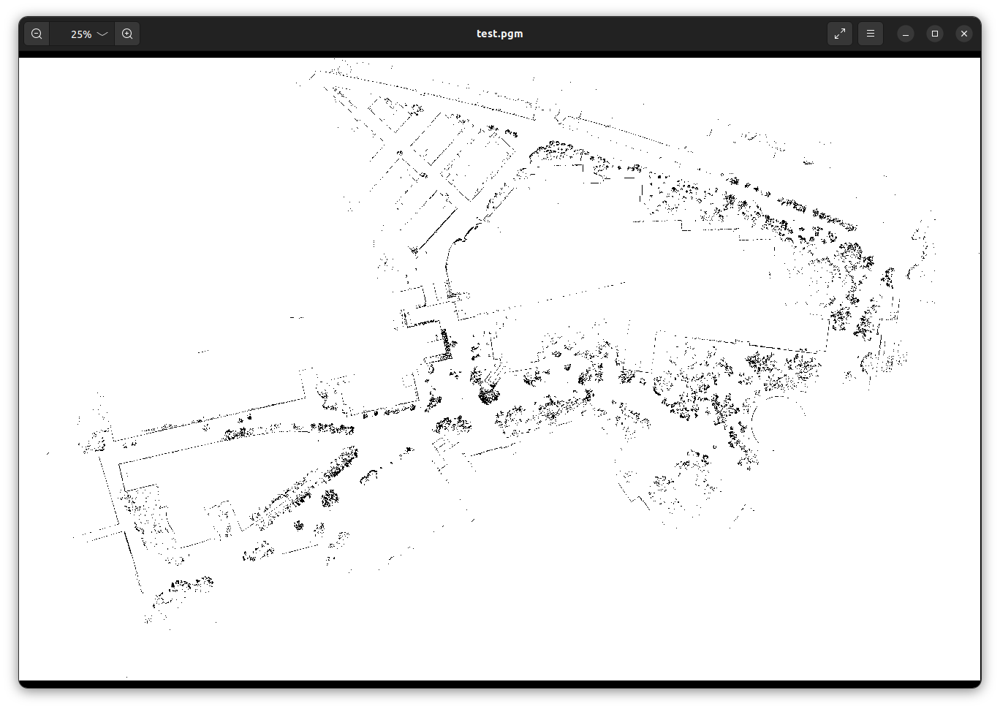

# pcd2pgm

ROS 2 + PCL tool to convert **`.pcd` point clouds into 2D occupancy grids**, exporting **`.pgm` + `.yaml`** compatible with Nav2 `map_server`.

| pcd | pgm |
|:-:|:-:|
|  |  |

## Table of Contents
- [Overview](#overview)
- [Development Environment](#development-environment)
- [Installation](#installation)
- [Usage](#usage)
- [Parameters](#parameters)
- [How it works](#how-it-works)
- [License](#license)

## Overview
This package reads a PCD file, filters and segments it, extracts obstacles relative to the local ground, and rasterizes the result to a PGM/YAML grid map.

**Implemented features (short):**
- **PCD loading**
- **Voxel downsample** (`VoxelGrid`)
- **Ground extraction** via **PMF** (Progressive Morphological Filter)
- **Outlier removal** via **SOR** (Statistical Outlier Removal)
- **Obstacle extraction**: for each non-ground point, estimate **local ground height** from the **K nearest ground points (KNN, K=12)** and keep points whose **height band** is within `[h_min, h_max]`
- **Grid map export**: generate **PGM** (occupied=black, free=white) and **YAML** (`mode: trinary`, map_server compatible)
- **Optional debug dumps** of intermediate clouds (`cloud_downsample.pcd`, `cloud_ground.pcd`, `cloud_nonground.pcd`, `cloud_obstacles.pcd`)

## Development Environment
- Ubuntu 22.04 (Jammy Jellyfish)
- ROS 2 Humble Hawksbill

## Installation
```bash
mkdir -p ~/ros2_ws/src
cd ~/ros2_ws/src
git clone https://github.com/kzm784/pcd2pgm.git
cd ~/ros2_ws
rosdep update && rosdep install --from-paths src --ignore-src -y
colcon build --symlink-install
```

## Usage
```bash
source install/setup.bash
ros2 launch pcd2pgm pcd2pgm.launch.py
```

## Parameters
Configure via `pcd2pgm/config/config_pcd2pgm.yaml`:

```yaml
pcd2pgm_node:
  ros__parameters:
    # I/O
    pcd_path: "/absolute/path/to/input.pcd"
    output_dir: "/absolute/path/to/output"
    save_map_name: "map"            # -> map.pgm / map.yaml

    # Downsample
    downsample_leaf_size: 0.10       # [m]

    # Ground (PMF)
    max_window_size: 20
    slope: 1.0
    initial_distance: 0.5
    max_distance: 3.0

    # Outlier removal (SOR)
    mean_k: 20
    stddev_mul: 1.0

    # Obstacle height band (relative to local ground)
    h_min: 0.10                      # [m]
    h_max: 2.00                      # [m]

    # Grid export
    resolution: 0.10                 # [m/cell]
    min_points_per_cell: 1           # occupied if >= this count

    # Debug
    save_all_cloud: false            # save intermediate PCDs
```

**Notes**
- YAML `origin: [min_x, min_y, 0.0]` is the **lower-left** of the obstacle bbox (no padding).
- PGM is written **top-down** (image rows reversed) to match ROS map conventions.
- Coordinate assumption: **Z is up**.

## How it works
1. Load PCD  
2. Downsample with `VoxelGrid`  
3. Split into ground / non-ground by **PMF**  
4. Denoise non-ground with **SOR**  
5. For each non-ground point, compute local ground z from **K nearest ground points (K=12)** and keep if `h_min ≤ (p.z - ground_z) ≤ h_max`  
6. Rasterize obstacle points: a cell becomes **occupied** if its point count ≥ `min_points_per_cell`  
7. Save **PGM + YAML** to `output_dir/save_map_name.{pgm,yaml}`

## License
[](LICENSE)

This project is licensed under the Apache License, Version 2.0.  
See the [LICENSE](LICENSE) file for details.